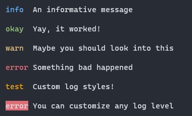

<p align="center">
  <h1 align="center">cutelog.js</h1>
  <p align="center">A simple, lightweight and beautiful console logger for Node.js</p>
</p>

<p align="center">
    
</p>

## Features
- Lightweight
- Easy to use
- Fully customizable
- Beautiful colors everywhere with [chalk](https://github.com/chalk/chalk)

## Installing
Cutelog is available from the npm library:
```
$ npm i cutelog.js
```

## Usage
The cutelog API is as simple as it gets:
```javascript
const log = require('cutelog.js')
const chalk = require('chalk')

// Out of the box, you get four log levels:
log.info("An informative message");
log.okay("Yay, it worked!");
log.warn("Maybe you should look into this");
log.error("Something bad happened");

// Any log level can be restyled:
log.configure('error', chalk.keyword('orange'));
log.error("Something bad happened, but in orange");

// And you can even define your own log levels:
log.configure('cat', chalk.keyword('magenta'))
log.custom('cat', "Nyan ~");

// You can also define completely custom formatters:
function formatter(input) {
    return `[ ${chalk.yellow(input)} ]`;
}
log.configure('info', formatter);
log.info("A custom formatted info message.");
```